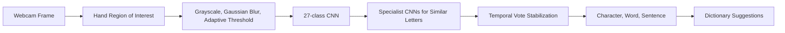

# American Sign Language to Text Converter

**Computer-vision prototype that recognizes static ASL alphabet gestures from a webcam and assembles them into text.**

## Problem Statement

Static hand-sign recognition requires more than image classification: the system must isolate the hand, distinguish visually similar letters, stabilize predictions over time, and convert a stream of letters into readable words.

## Architecture



## Model Design

- Base convolutional network: 842,107 trainable parameters across 27 classes, including blank.
- Specialist classifiers resolve visually similar groups: `D/R/U`, `D/I/K/T`, and `M/N/S`.
- A temporal counter accepts a character only after repeated stable predictions.
- `pyenchant` provides word-completion suggestions in the desktop interface.

## Tech Stack

- Python, TensorFlow/Keras
- OpenCV image preprocessing
- Tkinter desktop interface
- Pillow and PyEnchant
- Jupyter notebooks for data preparation and training

## Repository Structure

```text
Main.ipynb          Training and model analysis
create_data.ipynb   Dataset preparation
app2.py             Real-time recognition interface
camera.py           Webcam capture utility
model/              Serialized model architectures and weights
tests/              Import and repository smoke checks
```

## Setup

```bash
python -m venv .venv
source .venv/bin/activate
pip install -r requirements.txt
python app2.py
```

The application requires a webcam and an English dictionary available to PyEnchant.

## Evaluation

The repository includes the trained models and training notebook, but it does not contain a final reproducible test-set accuracy report. The honest next step is to add a fixed test split, per-class precision/recall, confusion matrix, and latency benchmark before comparing this system with modern approaches.

## Privacy and Responsible Use

- Webcam frames are processed locally by the desktop application.
- No biometric identity inference is performed.
- This prototype recognizes a constrained static alphabet; it is not a complete sign-language translation system.
- Real accessibility use requires signer-led evaluation across lighting, skin tones, hand shapes, motion, and regional language variation.

## Future Improvements

- Replace hand-crafted thresholding with robust hand landmark detection
- Add dynamic gestures and sequence modeling
- Quantize the model for lower-latency edge inference
- Publish a reproducible evaluation dataset and model card
- Test with ASL users and accessibility specialists

## Attribution

Dataset provenance is recorded in `Dataset link`. Review the source license before redistributing training data.
